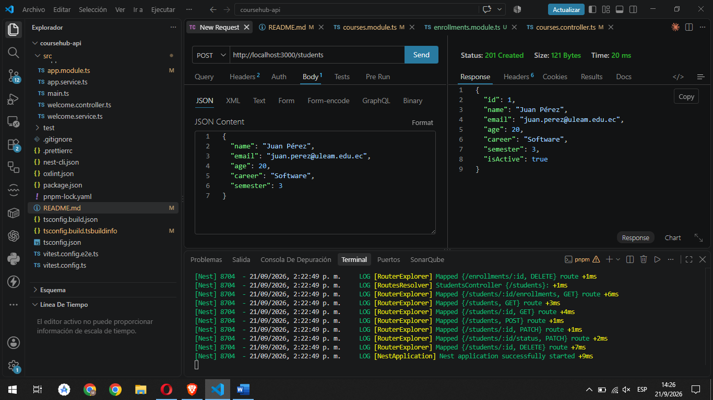

# CourseHub API

API REST desarrollada con NestJS para la gestión de **Cursos**, **Estudiantes** y **Matrículas**, utilizando almacenamiento en memoria (sin base de datos).

## Tecnologías

- NestJS
- TypeScript
- class-validator / class-transformer
- pnpm

## Instalación y ejecución

\`\`\`bash
pnpm install
pnpm run start:dev
\`\`\`

El servidor se levanta en `http://localhost:3000`.

---

## Módulo: Courses

| Método | Ruta               | Descripción                          |
|--------|--------------------|---------------------------------------|
| GET    | `/courses`         | Lista todos los cursos (filtro opcional `?level=`) |
| GET    | `/courses/:id`     | Consulta un curso por id             |
| POST   | `/courses`         | Crea un nuevo curso                  |
| PATCH  | `/courses/:id`     | Modifica parcialmente un curso       |
| DELETE | `/courses/:id`     | Elimina un curso                     |
| GET    | `/courses/:id/enrollments` | Lista las matrículas de un curso |

**Ejemplo — Crear curso**

Request:
\`\`\`json
POST /courses
{
  "title": "Testing NestJS",
  "level": "intermediate"
}
\`\`\`

Response `201 Created`:
\`\`\`json
{
  "id": 4,
  "title": "Testing NestJS",
  "level": "intermediate"
}
\`\`\`

---

## Módulo: Students

| Método | Ruta                     | Descripción                                  |
|--------|--------------------------|-----------------------------------------------|
| GET    | `/students`              | Lista estudiantes (filtros opcionales combinables: `career`, `semester`, `isActive`) |
| GET    | `/students/:id`          | Consulta un estudiante por id                |
| POST   | `/students`              | Registra un nuevo estudiante                 |
| PATCH  | `/students/:id`          | Modifica parcialmente un estudiante          |
| PATCH  | `/students/:id/status`   | Cambia exclusivamente el estado `isActive`   |
| DELETE | `/students/:id`          | Elimina un estudiante (solo si está activo)  |
| GET    | `/students/:id/enrollments` | Lista las matrículas de un estudiante     |

**Reglas de negocio**
- El `email` debe ser único.
- `semester` debe estar entre 1 y 10.
- No se puede eliminar un estudiante inactivo.

**Ejemplo — Crear estudiante**

Request:
\`\`\`json
POST /students
{
  "name": "Juan Pérez",
  "email": "juan.perez@uleam.edu.ec",
  "age": 20,
  "career": "Software",
  "semester": 3
}
\`\`\`

Response `201 Created`:
\`\`\`json
{
  "id": 1,
  "name": "Juan Pérez",
  "email": "juan.perez@uleam.edu.ec",
  "age": 20,
  "career": "Software",
  "semester": 3,
  "isActive": true
}
\`\`\`

**Ejemplo — Email duplicado**

Response `409 Conflict`:
\`\`\`json
{
  "message": "Ya existe un estudiante con ese correo",
  "error": "Conflict",
  "statusCode": 409
}
\`\`\`

**Ejemplo — Cambiar estado activo/inactivo**

Request:
\`\`\`json
PATCH /students/1/status
{
  "isActive": false
}
\`\`\`

**Ejemplo — Eliminar estudiante inactivo (bloqueado)**

Response `409 Conflict`:
\`\`\`json
{
  "message": "No se puede eliminar un estudiante inactivo",
  "error": "Conflict",
  "statusCode": 409
}
\`\`\`

---

## Módulo: Enrollments (Matrículas)

| Método | Ruta                | Descripción                                              |
|--------|---------------------|------------------------------------------------------------|
| GET    | `/enrollments`      | Lista matrículas (filtros opcionales combinables: `studentId`, `courseId`) |
| POST   | `/enrollments`      | Registra una nueva matrícula                              |
| DELETE | `/enrollments/:id`  | Cancela una matrícula                                     |

**Reglas de negocio**
- El estudiante y el curso deben existir.
- El estudiante debe estar activo.
- No puede existir una matrícula duplicada (mismo `studentId` + `courseId`).

**Ejemplo — Matrícula válida**

Request:
\`\`\`json
POST /enrollments
{
  "studentId": 1,
  "courseId": 1
}
\`\`\`

Response `201 Created`:
\`\`\`json
{
  "id": 1,
  "studentId": 1,
  "courseId": 1
}
\`\`\`

**Ejemplo — Matrícula duplicada**

Response `409 Conflict`:
\`\`\`json
{
  "message": "El estudiante ya está matriculado en este curso",
  "error": "Conflict",
  "statusCode": 409
}
\`\`\`

**Ejemplo — Estudiante inactivo**

Response `409 Conflict`:
\`\`\`json
{
  "message": "El estudiante no se encuentra activo",
  "error": "Conflict",
  "statusCode": 409
}
\`\`\`

**Ejemplo — Curso o estudiante inexistente**

Response `404 Not Found`:
\`\`\`json
{
  "message": "Curso con id 999 no encontrado",
  "error": "Not Found",
  "statusCode": 404
}
\`\`\`

**Ejemplo — Filtrar matrículas**

\`\`\`
GET /enrollments?studentId=1
GET /enrollments?courseId=1
\`\`\`

**Ejemplo — Cancelar matrícula**

\`\`\`
DELETE /enrollments/1
\`\`\`

Response `200 OK`:
\`\`\`json
{
  "id": 1,
  "studentId": 1,
  "courseId": 1
}
\`\`\`

**Ejemplo — Cancelar matrícula inexistente**

Response `404 Not Found`:
\`\`\`json
{
  "message": "Matrícula con id 999 no encontrada",
  "error": "Not Found",
  "statusCode": 404
}
\`\`\`

---

## Arquitectura

El proyecto sigue una organización modular por recurso, cada uno con su propia carpeta:

\`\`\`
src/
├── courses/
│   ├── dto/
│   ├── courses.controller.ts
│   ├── courses.service.ts
│   └── courses.module.ts
├── students/
│   ├── dto/
│   ├── pipes/
│   │   └── parse-int.pipe.ts
│   ├── students.controller.ts
│   ├── students.service.ts
│   └── students.module.ts
├── enrollments/
│   ├── dto/
│   ├── enrollments.controller.ts
│   ├── enrollments.service.ts
│   └── enrollments.module.ts
├── app.module.ts
└── main.ts
\`\`\`

Los controllers no contienen lógica de negocio: únicamente reciben la petición, delegan al service correspondiente y devuelven la respuesta. Las validaciones de entrada se realizan mediante DTOs con `class-validator`, y el `ValidationPipe` global (`whitelist: true, forbidNonWhitelisted: true`) rechaza cualquier dato no declarado en el DTO.

Se implementó un Pipe personalizado (`ParseIntPipe`) para transformar y validar los parámetros de ruta numéricos (`id`), reutilizado en los módulos `students` y `enrollments`.

Las dependencias circulares entre `EnrollmentsModule` y los módulos `CoursesModule`/`StudentsModule` (necesarias para las rutas anidadas de consulta) se resolvieron mediante `forwardRef()`.

pruebas

